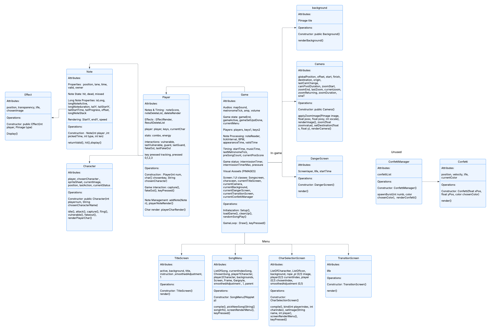

# Technical Details:

Period 3
Jaden Bae
OPM

2 Player Local split screen 4 Key rhythm game.

Minimum Vaiable Product:
- Using draw() to render each notes, in order to animate them.
- Using player class and note class to create objects and track data.
- Using scanner to load osu file of map / song and run it through program.
- Using arraydeque for efficient removal / addition of notes. 
- PVector value for note's positionto be displayed in screen.
- Player health system (take damage when other side gets it wrong, game ends when HP drains)

Nice to have features:
- Using PImage to display images for each player's actions (key pressed).
- Sound effects.

# Project Design

    
# Intended pacing:

Wednesday: Prototype (MVP) cont.

- Using draw() to render each notes, in order to animate them.
- Using player class and note class to create objects and track data.
- Using scanner to load osu file of map / song and run it through program.
- Using arraydeque for efficient removal / addition of notes. 
- PVector value for note's positionto be displayed in screen.

Thursday: Prototype (MVP)

- Player health system (take damage when other side gets it wrong, game ends when HP drains)

Sunday:
- Using PImage to display images for each player's actions (key pressed).
- Sound effects.

